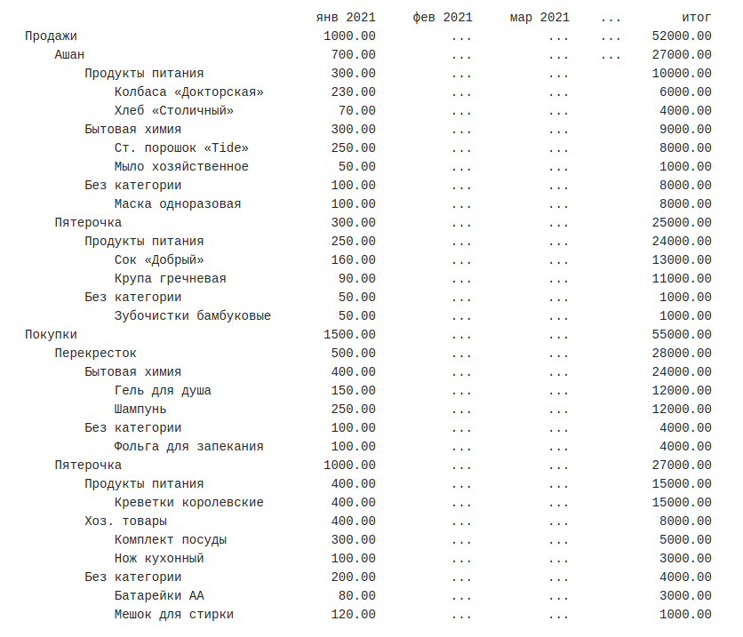

# Study-APS3-PurchaseReport
Antida Python School 3. Итоговое задание первого блока: "Отчет о покупках и продажах"

## Формулировка задания

В CSV файле приведены данные о покупках и продажах различных товаров в магазинах города в следующем формате:
`'type,date,shop,category,name,amount,price'`, где:

    type - тип операции: покупка (`buy`) или продажа (`sale`)
    date - дата совершения операции в формате `YYYY-mm-dd`
    shop - название магазина
    category - категория товара (может быть не заполнена)
    name - название товара
    amount - кол-во проданных/купленных единиц товара (целое или дробное число)
    price - стоимость товара за единицу

Необходимо сформировать отчет о покупках и продажах товаров в каждом из магазинов города по месяцам, вывести отчет в консоль.

### Требования к формату:

- отдельно выводятся группы продаж и покупок
- каждая группа разбивается по магазинам
- внутри магазинов разбиение по категориям товаров
- внутри категорий разбиение по товарам
- для каждой группы и всех их подгрупп выводится суммарная стоимость покупок/продаж за каждый месяц, а также в колонке "итог" - сумма по всем месяцам
- положение групп продаж и покупок фиксированное
- строки внутри каждой вложенной группы сортируются по убыванию итоговой суммы (в колонке "итог"), при равенстве — по алфавиту

### Пример отчета

Многоточие в примере используется в качестве сокращения, в реальном выводе должны присутствовать столбцы для каждого месяца.

## Как развернуть проект

    $ pip install virtualenv
    $ git clone https://github.com/jasper7466/Study-APS3-PurchaseReport.git
    $ cd ./Study-APS3-PurchaseReport
    $ python -m virtualenv venv
    $ . venv/Scripts/activate
    $ pip install -r requirements.txt

## Технологии

 - Python
 - CSV
